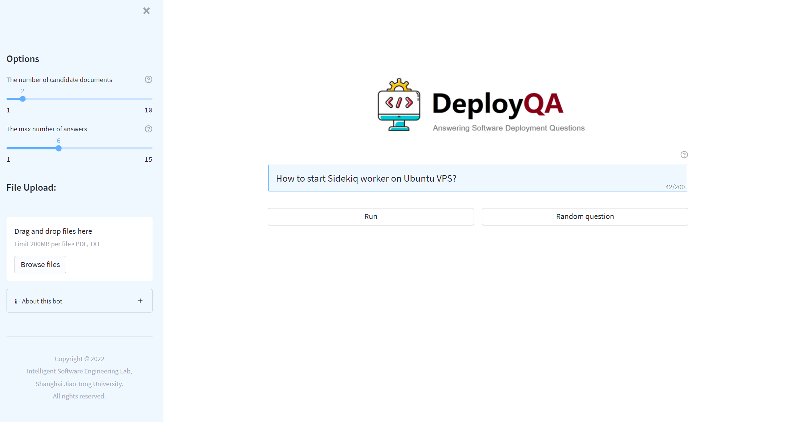
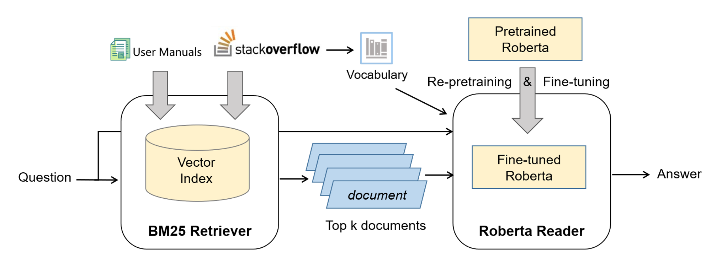

# DeployQA
Deploy QA is a tool that can automatically answers software deployment questions over user manuals and Stack Overflow posts.

# UI
 

## Architecture
 

The overall architecture of DeployQA is shown here. It leverages a retrieval-and-reader Framework. 

Given a question, a retriever first searches for candidate documents from a collection of user manuals and Stack Overflow posts. Then, a reader predicts the answer span from the selected documents using a domain-adapted RoBERTa model.

## Install
You can use docker to directly deploy our tool.

Execute in root folder:
```
docker-compose up
```
