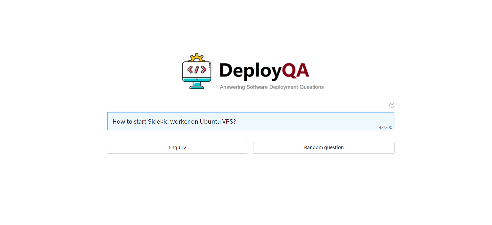
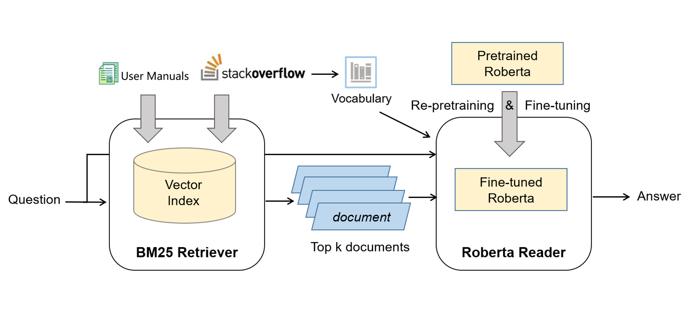

# DeployQA
DeployQA is a bot that can automatically answer software deployment questions over user manuals and Stack Overflow posts.

 


## Architecture
The overall architecture of DeployQA is shown here. It leverages a retrieval-and-reader Framework. 

Given a question, a retriever first searches for candidate documents from a collection of user manuals and Stack Overflow posts. Then, a reader predicts the answer span from the selected documents using a domain-adapted RoBERTa model.

 


## Install
You can use docker to directly deploy our tool.

**1. Pull docker images**
```
docker-compose pull
```

**2. Launch containers**
```
docker-compose up
```

**Note**: The following containers listens three ports:
* DeployQA Framework: listens on port 8000
* Elasticsearch: listens on port 9200
* Streamlit UI: listens on port 8501

## Usage
See usage video in [youtube](https://www.youtube.com/watch?v=TVf9w8gD3Ho).

## Evaluation
We evaluate the effectiveness of the proposed DeployQA on DeQuAD, a dataset that we created with 2,000 QAs from Stack Overflow. Experimental results show that DeployQA achieves
an F1-score of 49.85%, which significantly outperforms state-of-the-art approaches.


