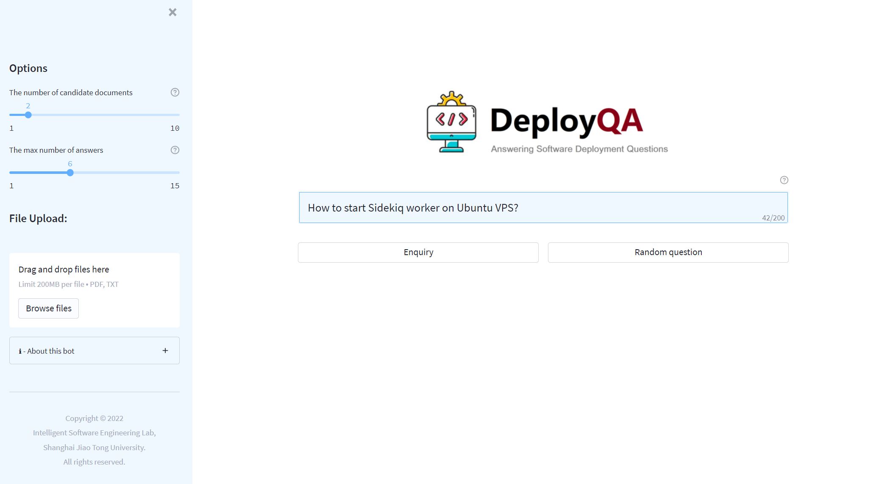

# DeployQA
 
Deploy QA is a tool that can automatically answers software deployment questions over user manuals and Stack Overflow posts.

## Architecture
 
The architecture of DeployQA is shown in the figure. where a retriever searches for candidate documents from a collection of user manuals and Stack Overflow posts, and a reader predicts the answer span from the selected documents using a domain-adapted RoBERTa model.
